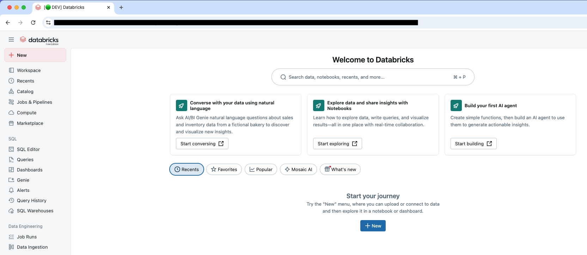

# databricks-tools

A collection of tools and utilities to improve the Databricks user experience.  
Each tool lives in this repository with its own installation and usage instructions.  

Currently included:  
- [Databricks Tab Emoji Label](#databricks-tab-emoji-label) — A Tampermonkey script that adds environment labels and emojis to browser tab titles.

---

## Databricks Tab Labeller

A [Tampermonkey](https://www.tampermonkey.net/) userscript that adds an **emoji + environment label** to your Databricks browser tab title.  

This helps quickly distinguish between **DEV**, **QA**, and **PROD** environments while working with multiple tabs.



### Features
- Adds `[🟢 DEV]`, `[🟡 QA]`, or `[🔴 PROD]` to the browser tab title.  
- Defaults to `[⚪ OTHER]` if the URL doesn’t match one of your configured environments.  
- Watches for URL changes inside Databricks (single-page app navigation).  
- Delay handling ensures the tab title update is not overwritten during reloads.  

### Installation

1. **Configure environment domains**  
   - Open `databricks-tab-emoji-label.js` in this repo.  
   - Edit the following variables near the top of the script:  
     ```js
     let devDomain = 'your-dev-domain';
     let qaDomain = 'your-qa-domain';
     let prodDomain = 'your-prod-domain';
     ```  
   - Update the `@match` lines at the top of the script so they match your Databricks environment domains.

2. **Install Tampermonkey**  
   - [Download Tampermonkey](https://www.tampermonkey.net/) for your browser.  
   - Restart your browser after installing.

3. **Add the script**  
   - Click the Tampermonkey extension → **Dashboard** → **Create a new script**.  
   - Paste in your edited script code.  
   - Save the script (`File → Save`). It should be enabled by default (green toggle).

4. **Enable user scripts** (Chrome/Chromium-based browsers only)  
   - Go to `chrome://extensions` → find **Tampermonkey** → click **Details**.  
   - Ensure **Allow user scripts** is turned **on**.

5. **Verify installation**  
   - Open your Databricks environment in a new tab.  
   - After a few seconds, your tab title should display the correct emoji + environment label.  

> **Note:** These instructions are written for Google Chrome. If you’re using another browser (Firefox, Edge, Safari), the steps are very similar, but you may need to adapt the extension settings.

---

### Troubleshooting

**Tab title doesn’t update right away**  
- The script intentionally waits **3 seconds** after page load before applying changes.  
- Without this delay, the title gets updated but is overwritten during the web page loading process.
- In testing, **3 seconds worked well**, but you can adjust this by editing the `setTimeout` call in the code:  

  ```js
  setTimeout(updateTitle, 3000);
  ```

**Still not working?**

Double-check that:

- The script is enabled in Tampermonkey.
- Your domains are correctly set in both the variables and the @match lines.
- “Allow user scripts” is enabled in your browser’s extension settings.

---

### Customization

- Add rules for additional domains (e.g., staging or admin portals).
- Change the emojis to suit your preference (🔵, 🟠, etc.).
- Adjust the timeout delay if your pages load slower/faster.
